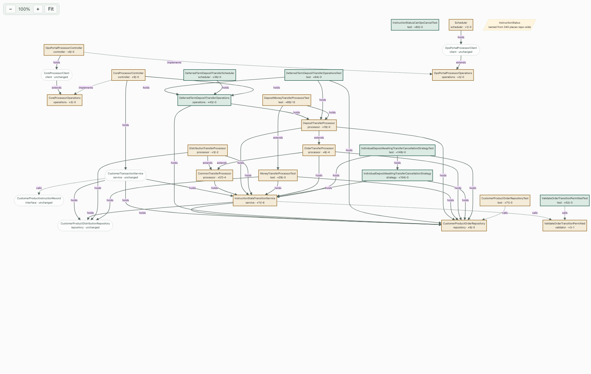

# PR Map

An IntelliJ plugin that draws the types a change set touches and how they reach one
another, so a large pull request has a place to start rather than an alphabetical list of
files. Clicking a box opens that type's diff against the base.



## What problem it solves

GitHub lists the files a pull request changes in path order. That order says nothing about
which file drives the change, which files it pulls in, or which parts are independent. A
reviewer has to rebuild that picture by hand every time.

This plugin builds it from the code. It resolves every changed file to the type it
declares, works out how those types reach one another, and pulls in the untouched types
that join two changed ones — so a path that runs through code the change set never touched
is still visible.

## Install

Download or build `pr-map-<version>.zip`, then in IntelliJ:

**Settings → Plugins → the gear icon → Install Plugin from Disk…** → pick the zip →
restart. A **PR Map** tool window appears on the right of every project window.

Needs `git` and `python3` on the path. Both ship with macOS; nothing else is installed.

## Use

The toolbar has one selector with three sources:

| source | what it maps |
| --- | --- |
| current branch | `HEAD` against a base ref, which defaults to `origin/main` |
| base…head | any two refs you type |
| pull request | a PR number, resolved through the `gh` CLI |

Leave **no tests** ticked to keep test sources and test resources out. Press **Draw**.

In the diagram: drag to pan, ctrl-scroll or the buttons to zoom, **Fit** to frame it.
Clicking a box opens it —

- a **changed** type opens as a diff, with the file at the merge-base on the left and your
  working tree on the right;
- an **untouched** type opens as a plain file, because it has nothing to compare.

The right side of a diff is the working tree rather than the branch head, so uncommitted
edits appear in it. That is what you want while reviewing your own branch, and it is not
what GitHub shows for a pull request.

## Reading the diagram

- A **square** box is a type the change set touches. Green fill means added, amber means
  modified.
- A **rounded, dashed** box is untouched, and appears only because it lies on a path
  between two changed types, or because two changed types both depend on it.
- A **parallelogram** is a type the whole repository names, such as a status enum. It is
  drawn on its own, because wiring it in joins every branch to every other one and hides
  the structure.
- Arrow labels are the relationship: `extends`, `implements`, `holds` (a constructor
  parameter or a field, which is the injection graph) and `calls`.

Two rules keep a diagram of this size readable, and both are deliberate.

Call edges are hidden, except where a call is the only edge a type has, so a unit test
never floats free of the type it tests. Untouched types that merely name two changed types
are also left out, because a dozen of them all pointing at the same two services buries the
shape; they still tell you the blast radius, so the terminal report keeps them.

## How the analysis works

Every changed `.java` or `.kt` file maps to the type it declares. For each type the
analysis records what it extends, what it implements, what it holds and what it otherwise
names, taking the strongest relationship when two types relate twice.

Three kinds of untouched type then earn a place:

- one that lies on a path from one changed type down to another;
- one that names two or more changed types, which is the blast radius;
- one that two or more changed types depend on **and** that joins parts of the map
  otherwise separate — a shared base class or interface. A shared dependency between two
  types that already reach each other is left out, because it adds a row and no link.

A type the whole repository names does not count as a connection while the analysis looks
for what is already joined. Without that rule a single status enum makes everything look
connected and no bridge is ever found.

A changed file that declares no type — a `.feature` file, a resource — is reported
separately, linked to a changed type when it names that type or repeats a string literal
the type declares, such as a job name.

### Limits

The analysis resolves **types, not calls**: it reports that one type names another, never
which method, so a click lands on the type declaration rather than on a method. It reads
imports and same-package names, so a wildcard import resolves to nothing, and a reference
reachable only through reflection or through configuration is invisible. Java and Kotlin
only.

## Layout

```
src/main/kotlin/dev/joelreason/prmap/
  PrMapToolWindowFactory.kt   registers the tool window
  PrMapPanel.kt               toolbar, the embedded browser, and opening a file or a diff
  Analyser.kt                 runs the bundled analysis and bounds how long it may take
  Topology.kt                 the model the analysis produces
  Diagram.kt                  the drawing rules, and the Mermaid text
  Page.kt                     the page: zoom, pan, and the click that reaches the plugin
  WrapLayout.kt               a toolbar that wraps instead of hiding its controls
  Diagnose.kt                 runs the parsing and drawing outside the IDE
src/main/resources/prmap/
  topology.py                 the analysis
  mermaid.min.js              vendored, so the diagram draws with no network
```

`topology.py` is the analysis and the plugin carries it as a resource, copied to a
temporary file on first use. It is a script rather than Kotlin because it reads the whole
repository through one `git cat-file --batch`, and because the same script runs from a
terminal against any repository.

## Build

```bash
JAVA_HOME=~/.sdkman/candidates/java/17.0.3.6.1-amzn ./gradlew buildPlugin
# build/distributions/pr-map-<version>.zip
```

Everything targets JVM 17 against platform 2024.1, which is the last line that runs on 17.
A plugin built against it still loads in a newer IDE — `plugin.xml` sets `since-build` and
no upper bound. Gradle 8.10 refuses to run on Java 25, so point `JAVA_HOME` at a 17.

Run the parsing and the drawing rules against a real change set without starting an IDE:

```bash
python3 src/main/resources/prmap/topology.py --base origin/main --head HEAD \
  --no-tests --out /tmp/map.json --repo /path/to/repo
./gradlew diagnose -Pmap=/tmp/map.json
```

## Analysis options

`topology.py --help` lists them all. The ones worth knowing:

- `--pr N` — resolve a pull request through `gh`, rather than two refs.
- `--no-tests` — leave test sources and test resources out of the change set.
- `--max-bridge N` (3) — the longest path between two changed types to follow.
- `--hub-fan-in N` (50) — the repo-wide reference count above which a type counts as named
  from everywhere.
- `--max-shared-callers N` (12) — the cap on each kind of bridge.
- `--test-bridges` — let untouched test classes bridge two changed types. Off by default,
  because a test that names two changed types explains nothing about how production code
  fits together.
